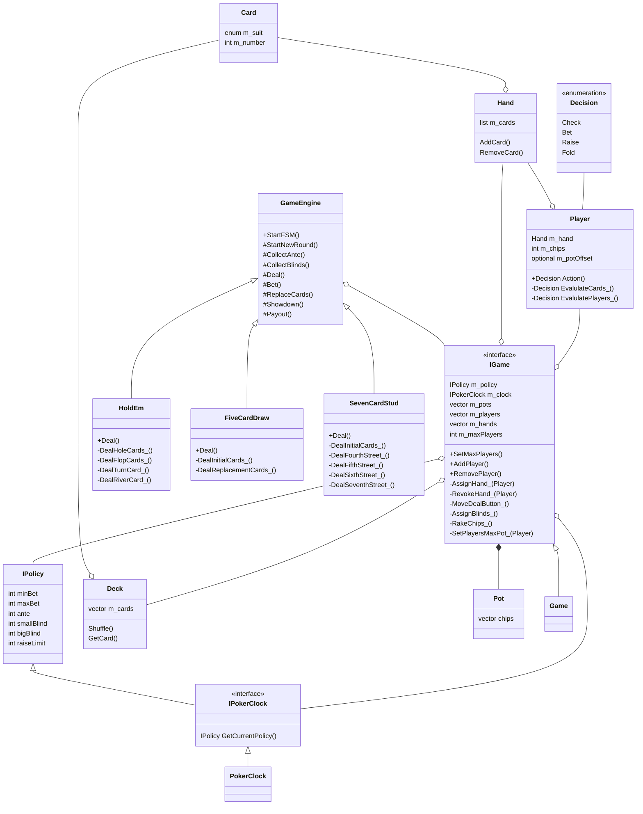

# Poker

# UML Class Diagrams

| Class         | Description                                                          |
| ------------- | -------------------------------------------------------------------- |
| IPolicy       | Data needed for each poker round (ante, min/max bet, raise limit)    |
| IPokerClock   | Abstract interface to use for testing                                |
| PokerClock    | Responsible for periodically updating policy data                    |
| Deck          | A deck of cards that can be shuffled and retrieve one card at a time |
| Card          | One of 52 unique cards in a deck assigned a suit and a number (1-13) |
| Hand          | Poker hands consist of 5 or 7 cards or 2 cards + 5 community cards   |
| Pot           | Chips are added to the pots - need to handle all-in players          |
| Decision      | Player's decision: check, call, bet, raise, fold                     |
| IGame         |                                                                      |
| Game          | Data shared with players: pot size, active hands, other player chips |
| Player        | Holds player's hand and chips. Player decision is made when betting. |
| GameEngine    | FSM driven by game type. Find next player, start bet, rake chips.    |
| IGameEngine   | Interface to be implemented by different poker games.                |
| HoldEm        | Implements IGameEngine with Texas Hold 'Em rules.                    |
| FiveCardDraw  | Implements IGameEngine with five card draw rules.                    |
| SevenCardStud | Implements IGameEngine with seven card stud rules.                   |

