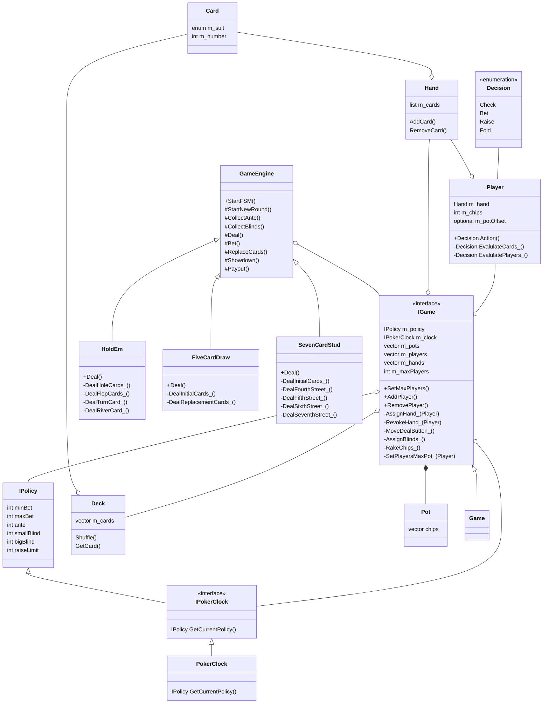

# Introduction

Initial attempt at designing classes needed for a poker game engine/system. The
system should handle different types of games like: Five Card Draw, Seven Card
Stud, and Texas Hold'Em.

Pure abstract interfaces should be used to allow for unit testing with Mock
interfaces and allow for Dependency Injection to choose different game engines.

# Notes About Different Games

Basic structure of the different game types are similar but the differences
might be a pain in the butt.

- First player to act can be:
  - Player to the left of dealer,
  - Player with the highest (or lowest) card showing,
  - Player left of Big Blind (BB) button.
- Antes:
  - Never,
  - Always,
  - After X minutes of playing.
- Blinds:
  - Dead buttons (BB player out in last hand becomes Small Blind (SB) in next
    hand even though they are out of the game),
  - New players may be required to pay BB to join game after it has started.

Maybe a Finite State Machine (FSM) could be used to create a generic game
engine that each game type would implement. Any states that aren't relevant
are possibly handled by advancing to the next state.

Publish/Subscribe could be used to allow players to perform whatever logic they
want in deciding whether to call, raise, or fold.

# Classes

| Class         | Description                                                          |
| ------------- | -------------------------------------------------------------------- |
| Card          | One of 52 unique cards in a deck assigned a suit and a number (1-13) |
| IDeck         | A deck of cards that can be shuffled and retrieved one card at a time|
| IHand         | Poker hands consist of 5 or 7 cards or 2 cards + 5 community cards.  |
| IPlayer       | Holds player's hand and chips. Player decision is made when betting. |
| IGame         | Interface used by game engine to manage game play.                   |
| IPolicy       | Data needed for each poker round (ante, min/max bet, raise limit)    |
| IPokerClock   | Poker clock periodically increases limits. Returns current policy.   |
| IGameEngine   | Interface to generic FSM logic that applies to all IGame types.      |
|               |                                                                      |
| Pot           | Chips are added to the pots - need to handle all-in players          |
| Decision      | Player's decision: check, call, bet, raise, fold                     |
| HoldEm        | Implements IGame with Texas Hold 'Em rules.                          |
| FiveCardDraw  | Implements IGame with five card draw rules.                          |
| SevenCardStud | Implements IGame with seven card stud rules.                         |

# UML Class Diagrams

